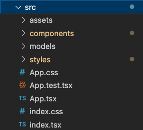
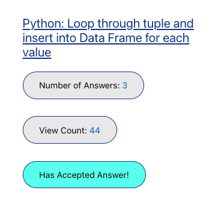
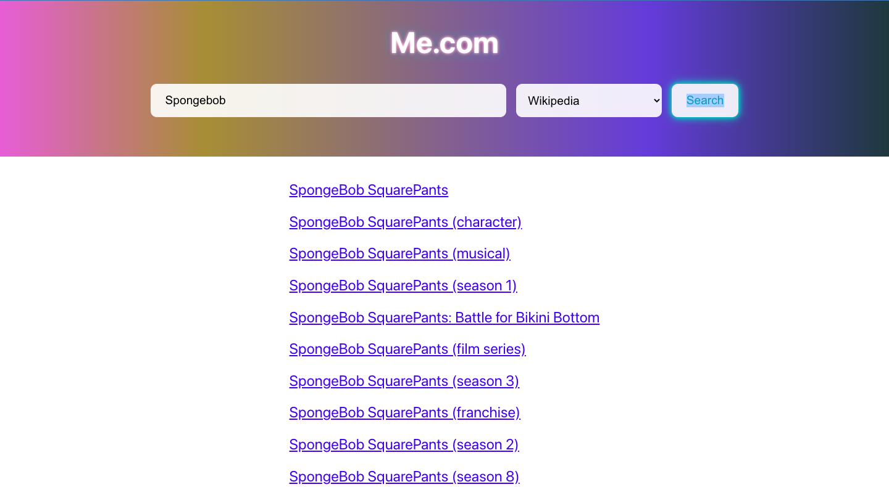

## Me.com! https://medotcom.netlify.app/  
Link: https://medotcom.netlify.app/
 
### APIs Supported 

✅ StackOverflow API  
✅ Giphy API  
✅ Wikipedia API  

 

### Project Overview

  

/assets -> Contains images  
/components -> Components that make up the web app  
/models -> API models for the API response data  
/styles -> css files and styling  

Deployed manually on Netlify through Netlify CLI

### UI Design Thought Process

Overall Design Choice 🔮  
I first thought of a theme and chose just a very simple UI which is composed of a search bar with a toggle at the top of the page (to choose which source to search from), and the results as the bulk of the website. Pretty standard and effective. I liked the toggle because it can allow for scaling to more API options and it's more efficient then rendering every possiblity every time. 
I think one reason I like Google over Bing.com and other search engines is because their front page.Google.com & You.com is very simple while a search engine like Bing.com have too stuff going on. There are articles, news, and this take a long time to load and are unnessesary.  
Made it also response to be viewed on phones and smaller devices.  

StackOverflow Search API ⚙️  
  
To showcase the StackOverflow search API data I made sure to include the title (with a hyperlink), the number of views, number of answers, and whether or not the question has an accepted answer.  
I only included these because I wanted the result data to be minimalistic and only show the attributes that any dev would look for. As a dev myself I would love to know if the stackoverflow question was answered, the number of answers (the more the better), and maybe the number of views (because too few can indicate inactivity).  

GIPHY Search API ⚙️  

  
I love gifs. So for this API I included the actual GIF and the title (which includes a hyperlink to the source of the gif on giphy.com)

Wikipedia Search API ⚙️  

  
Wikipedia API was interesting. A typical search engine would include a short summary and I could of done that with the advanced search API params but decided not to. This is because most people who search for Wikipedia links most likely want a deeper understanding then some 1 or 2-liner that barely communicates anything and regardless still leads the user to click on the Wikipedia link. I decided to just showcase the title (which leads to wikipedia link) of potential options. 

 
Built by Eric Sheen